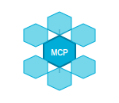

<p align="center">
  
</p>

# Claude Code Developer Guide for Go MCP SDK

A comprehensive guide for developers using Claude Code to develop applications with or migrate to the high-performance Go MCP SDK.

## Table of Contents

- [Quick Start with Claude Code](#quick-start-with-claude-code)
- [Migration Assistance](#migration-assistance)
- [Code Generation Patterns](#code-generation-patterns)
- [Testing and Validation](#testing-and-validation)
- [Performance Optimization](#performance-optimization)
- [Troubleshooting](#troubleshooting)
- [Best Practices](#best-practices)

## Quick Start with Claude Code

### Setting Up Your Development Environment

When working with Claude Code, provide this context for optimal assistance:

```markdown
I'm developing an MCP application using the Go MCP SDK (github.com/rubys/mcp-go-sdk).

Key information:
- This SDK provides 7x+ better performance than TypeScript MCP SDK
- Supports stdio, SSE, WebSocket, and HTTP transports
- Has 100% TypeScript SDK compatibility
- Includes mark3labs/mcp-go compatibility layer
- Designed for concurrent, high-performance applications

Documentation available:
- API Documentation: docs/API.md
- Migration Guide: docs/MIGRATION_GUIDE.md  
- Examples: docs/EXAMPLES.md
- Performance Guide: docs/PERFORMANCE_COMPARISON.md
```

### Initial Project Setup

Ask Claude Code to help you set up your project structure:

**Prompt:**
```
Help me create a new MCP server project using the Go MCP SDK. I want:
1. A basic project structure with go.mod
2. A simple echo server that demonstrates tools and resources
3. Proper error handling and logging
4. Concurrent processing capabilities
5. TypeScript SDK compatibility
```

**Expected Output:** Claude will generate a complete project structure with proper imports, error handling, and concurrent patterns.

### Asking for Code Reviews

When requesting code reviews from Claude Code, use this format:

**Prompt:**
```
Please review this Go MCP SDK code for:
1. Performance optimization opportunities
2. Proper concurrent patterns (goroutines, channels, mutexes)
3. TypeScript SDK compatibility
4. Error handling best practices
5. Resource cleanup and memory management

[Your code here]
```

## Migration Assistance

### From TypeScript MCP SDK

**Effective Prompts for Migration:**

```
I need to migrate this TypeScript MCP server to the Go MCP SDK:

[TypeScript code]

Requirements:
- Maintain 100% API compatibility with existing clients
- Improve performance (target 7x+ improvement)
- Use concurrent patterns where appropriate
- Handle the same tool/resource/prompt operations
- Keep the same configuration options
```

**Follow-up Optimization:**
```
Now optimize this migrated Go code for:
1. Maximum concurrency without race conditions
2. Memory efficiency (object pooling, buffer reuse)
3. Connection pooling and transport optimization
4. Proper context cancellation and timeouts
```

### From mark3labs/mcp-go

**Migration Prompt:**
```
Help me migrate this mark3labs/mcp-go code to the high-performance Go MCP SDK:

[mark3labs code]

Use the compatibility layer (github.com/rubys/mcp-go-sdk/compat) to:
1. Minimize code changes
2. Maintain the fluent builder API
3. Gain the performance benefits of the new SDK
4. Add proper transport initialization
```

### Analyzing Existing Codebases

**Codebase Analysis Prompt:**
```
Analyze this existing codebase and create a migration plan to Go MCP SDK:

Goals:
1. Identify all MCP operations (tools, resources, prompts)
2. Map current architecture to Go SDK patterns
3. Identify performance bottlenecks that Go SDK can solve
4. Create step-by-step migration plan
5. Estimate performance improvements

[Provide file structure or key files]
```

## Code Generation Patterns

### Server Development

**Generate Complete MCP Server:**
```
Create a production-ready MCP server using Go MCP SDK with:

Capabilities:
- File system operations (read, write, list)
- Database queries (SQL execution)
- Web scraping tools
- Progress notifications for long operations
- OAuth 2.0 authentication for HTTP transport

Requirements:
- Handle 1000+ concurrent requests
- Proper error handling and logging
- Resource cleanup and graceful shutdown
- Comprehensive test coverage
- Docker deployment ready
```

**Generate Specific Components:**
```
Create a typed tool handler for [specific functionality] that:
1. Uses strongly typed arguments with validation
2. Supports progress notifications
3. Handles cancellation properly
4. Includes comprehensive error handling
5. Is optimized for concurrent execution
```

### Client Development

**Generate MCP Client:**
```
Create an MCP client application that:
1. Connects to multiple MCP servers concurrently
2. Implements connection pooling and retry logic
3. Handles different transport types (stdio, WebSocket, HTTP)
4. Provides a clean API for tool execution
5. Includes proper resource management
```

### Transport Configuration

**Generate Transport Setup:**
```
Create transport configurations for:
1. Development: stdio with debug logging
2. Production: WebSocket with reconnection
3. Cloud: HTTP with OAuth 2.0 and load balancing
4. Edge: Optimized for low latency and memory usage

Include connection pooling, timeouts, and error recovery.
```

## Testing and Validation

### Test Generation

**Comprehensive Test Suite:**
```
Generate comprehensive tests for this MCP server code:

[Your server code]

Include:
1. Unit tests for each tool/resource handler
2. Integration tests with real transport
3. Concurrent load testing (race condition detection)
4. TypeScript SDK compatibility tests
5. Performance benchmarks vs TypeScript SDK
6. Error scenario testing
7. Memory leak detection tests
```

**Performance Testing:**
```
Create performance tests that validate:
1. 7x+ improvement over TypeScript SDK
2. Linear scaling with concurrent requests
3. Memory efficiency under load
4. Latency measurements (P50, P95, P99)
5. Resource utilization (CPU, memory, goroutines)
```

### Compatibility Validation

**TypeScript Compatibility:**
```
Create tests that validate 100% compatibility with TypeScript MCP SDK:
1. Parameter format compatibility
2. Response format matching
3. Error message compatibility
4. Progress notification format
5. Cross-platform integration tests
```

## Performance Optimization

### Performance Analysis

**Optimization Request:**
```
Analyze this Go MCP SDK code for performance optimization:

[Your code]

Focus on:
1. Goroutine usage and channel patterns
2. Memory allocation patterns
3. I/O efficiency
4. Lock contention
5. GC pressure
6. Connection pooling

Provide specific improvements with benchmarks.
```

### Scaling Guidance

**Scaling Architecture:**
```
Design a scalable architecture using Go MCP SDK for:
- 10,000+ concurrent clients
- Multiple server instances
- Load balancing strategies
- Database connection pooling
- Caching layers
- Monitoring and metrics

Include deployment configuration for Kubernetes.
```

## Troubleshooting

### Debug Assistance

**Debugging Issues:**
```
I'm experiencing [specific issue] with my Go MCP SDK application:

[Error logs/symptoms]

Help me:
1. Identify the root cause
2. Implement proper debugging
3. Add logging and monitoring
4. Prevent similar issues
5. Test the fix thoroughly
```

### Common Problems

**Race Condition Detection:**
```
Review this code for potential race conditions:

[Concurrent code]

Check for:
1. Shared state access without synchronization
2. Channel usage patterns
3. Goroutine lifecycle management
4. Resource cleanup races
5. Suggest fixes with proper synchronization
```

**Memory Issues:**
```
Analyze this code for memory efficiency:

[Code with potential memory issues]

Look for:
1. Memory leaks
2. Excessive allocations
3. Large object retention
4. Buffer management
5. Suggest optimizations with object pooling
```

## Best Practices

### Code Organization

**Project Structure:**
```
Design an optimal project structure for a large MCP application:
1. Package organization
2. Dependency management
3. Configuration management
4. Testing structure
5. Documentation organization
6. CI/CD integration
```

### Security

**Security Review:**
```
Review this MCP server for security best practices:

[Server code]

Check for:
1. Input validation and sanitization
2. Authentication and authorization
3. Rate limiting and DoS protection
4. Secure transport configuration
5. Secrets management
6. Error information disclosure
```

### Production Deployment

**Production Readiness:**
```
Make this MCP server production-ready:

[Development code]

Add:
1. Comprehensive logging and monitoring
2. Health checks and readiness probes
3. Graceful shutdown handling
4. Configuration management
5. Docker containerization
6. Kubernetes deployment manifests
7. Observability (metrics, tracing)
```

## Advanced Patterns

### Custom Transport Development

**Transport Implementation:**
```
Help me implement a custom transport for [specific protocol]:
1. Implement the Transport interface
2. Handle connection management
3. Implement proper error handling
4. Add connection pooling
5. Support concurrent operations
6. Include comprehensive tests
```

### Extension Patterns

**SDK Extensions:**
```
Create reusable extensions for the Go MCP SDK:
1. Middleware for authentication
2. Caching layer for resources
3. Rate limiting for tools
4. Request/response logging
5. Metrics collection
6. Circuit breaker patterns
```

## Performance Benchmarking

### Benchmark Generation

**Create Benchmarks:**
```
Generate comprehensive benchmarks comparing:
1. This Go MCP SDK vs TypeScript SDK
2. Different transport types
3. Concurrent vs sequential processing
4. Memory usage patterns
5. Latency measurements
6. Throughput under load

Include visualization and reporting.
```

## Code Quality

### Static Analysis

**Code Quality Review:**
```
Perform comprehensive code quality analysis:
1. Go best practices compliance
2. Error handling patterns
3. Documentation completeness
4. Test coverage analysis
5. Performance anti-patterns
6. Security vulnerability scan
```

### Refactoring

**Code Improvement:**
```
Refactor this code for better:
1. Maintainability and readability
2. Performance and efficiency
3. Error handling and resilience
4. Testing and testability
5. Concurrent safety
6. Resource management
```

## Integration Examples

### Real-World Applications

**Application Templates:**
```
Create complete application templates for:
1. AI agent with tool execution
2. Database proxy with connection pooling
3. File system server with caching
4. Web API gateway with rate limiting
5. IoT data aggregation service
6. Microservice integration hub
```

### Monitoring and Observability

**Observability Setup:**
```
Add comprehensive observability to this MCP server:
1. Prometheus metrics
2. OpenTelemetry tracing
3. Structured logging
4. Health checks
5. Performance dashboards
6. Alerting rules
```

---

## Tips for Effective Claude Code Collaboration

1. **Provide Context**: Always mention you're using the Go MCP SDK and its performance characteristics
2. **Be Specific**: Include exact error messages, performance requirements, and constraints
3. **Request Testing**: Always ask for tests alongside code generation
4. **Ask for Optimization**: Request performance analysis and optimization suggestions
5. **Validate Compatibility**: Ensure TypeScript SDK compatibility when needed
6. **Include Documentation**: Request inline documentation and README updates

This guide enables Claude Code to provide optimal assistance for developing high-performance MCP applications with the Go SDK.